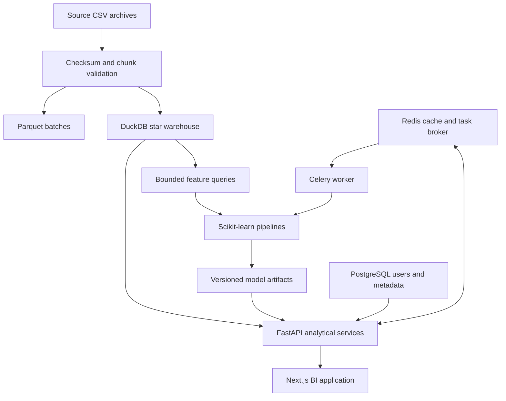

# Architecture and decisions

ATLAS BI separates reproducible data processing from request handling. The source is a behavioral event log, not an accounting ledger. Purchase-event value is an observed measure; a purchasing session is only a basket proxy. Refunds, costs, stock and locations are unavailable.

## Decisions

- **DuckDB + Parquet for analytics:** columnar scans, spill-to-disk and bounded client batches suit an 8 GB laptop. One ingestion writer runs offline; do not mutate its database while API processes hold it open. Production refreshes should build a separate snapshot, stop readers briefly, then promote it. Multiple independent analytical replicas need immutable snapshots, not shared writable DuckDB files.
- **PostgreSQL for application state:** users and authorization are relational and durable. SQLite is a local shortcut. A warehouse export demonstrates indexed PostgreSQL star tables where operational requirements favor that engine; no dual-write guarantee is claimed.
- **Redis and Celery are optional locally:** caches must not be the source of truth. Run a single worker with concurrency one on low-memory machines. Use full infrastructure only when working on distributed jobs.
- **No unrestricted text-to-SQL:** a small intent router maps supported English questions onto validated analytical services. Unsupported questions return a clear limitation. Numerical explanations show date windows and provenance; correlations are not causal explanations.
- **Explicit capability boundaries:** stock recommendations are assumption-driven scenarios. Geography and profitability are unsupported because the source lacks those columns. A five-month historical dataset cannot establish annual seasonality or present-day business performance.
- **CPU-only models:** tree ensembles, linear classifiers, K-Means and Isolation Forest fit the scope. XGBoost, Optuna and Polars are deliberately omitted until a measured need justifies them. MLflow is optional experiment tracking rather than a mandatory service.

## Operating envelope

Start with a deterministic customer sample across all months; do not take only the first N rows for temporal evaluation. Use 100k-row ingestion chunks, two DuckDB threads, a 1 GB database memory budget and bounded model samples. Download archives sequentially. Full data runs need enough disk for source archives, extracted files, warehouse, Parquet and spill, and should be measured separately from local sample benchmarks.

## Security and production boundary

Tokens expire, passwords are hashed, roles protect privileged operations and report queries use fixed identifiers. Secrets come from environment variables. Deploy behind TLS, use private database/Redis networking, rotate secrets, add a managed identity provider and central monitoring before handling real customer data. This is a production-style portfolio implementation, not a claim of audited production readiness. Public demos expose aggregates or clearly labeled fixtures, never individual customer histories.
